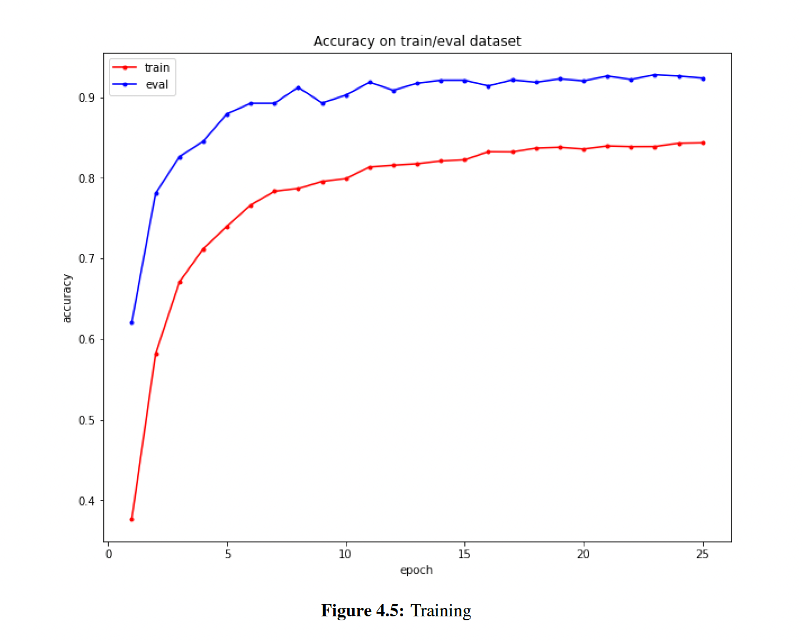

# Dynamic Range Compression Optimization for Hearing Aids in Noisy Environments

## Abstract

Dynamic range compression (DRC) is a pivotal algorithm utilized in modern hearing aids to amplify quiet sounds while reducing loud sounds, thereby enhancing the listening experience for individuals with hearing loss. However, the effectiveness of DRC diminishes in noisy environments, where distortion and amplified background noise can impede speech understanding. This research endeavors to explore the constraints of DRC in noisy settings and propose innovative strategies to optimize dynamic range control through signal processing theory. By employing mathematical models and analyzing compression effects on combinations of multiple sounds, this study seeks to ameliorate hearing aid performance in challenging auditory conditions.

## Objectives

1. **Investigate Limitations of DRC in Noisy Environments:**
   Identify factors contributing to reduced speech intelligibility and assess the shortcomings of dynamic range compression algorithms in noisy settings.

2. **Explore Novel Signal Processing Techniques:**
   Evaluate and develop innovative signal processing techniques and algorithms aimed at improving DRC performance in noisy environments, focusing on minimizing background noise amplification while preserving speech clarity.

3. **Develop an Adaptive DRC Algorithm:**
   Design and implement an adaptive dynamic range compressor capable of adjusting to varying noise conditions, thereby enhancing speech understanding for individuals with hearing impairment.

4. **Evaluate Performance:**
   Assess the efficacy of the proposed DRC algorithm through subjective and objective evaluation measures, comparing it with existing methods and benchmarking against standard performance metrics.

5. **Assess Usability and User Satisfaction:**
   Investigate the usability and user satisfaction of the optimized DRC algorithm through user studies and surveys, considering factors such as ease of use, comfort, and overall improvement in the listening experience.

## Proposed Plan

### 1. Implementation of Speech Recognition using Neural Networks:
   - Apply a neural network-based model for speech recognition on the robot platform.

### 2. Encoding Implementation and Signal Recognition:
   - Implement an encoding mechanism to optimize signal representation.
   - Evaluate signal recognition accuracy post-encoding process.

### 3. Dynamic Range Compression Integration:
   - Develop and integrate a dynamic range compressor into the system to improve recognition accuracy in varying noise environments.

   # Recurrent Neural Networks (RNNs)

Recurrent Neural Networks (RNNs) are a type of artificial neural network designed to process sequential data [1]. Unlike traditional feedforward neural networks, RNNs can take into account the previous state of the sequence while processing the current state, allowing them to model temporal dependencies in data.

# Dynamic Range Compression

Dynamic Range Compression (DRC) is a signal processing technique used to reduce the dynamic range of an audio signal. The dynamic range is the ratio of the loudest to the quietest parts of the signal, usually measured in decibels (dB).

# Threshold

The threshold (T) is the level above which the compressor starts reducing the signal. Signals above the threshold are reduced, while signals below the threshold are unaffected.

# Training and Evaluation Plot

The plot below shows the training and evaluation accuracy of a sound recognition model over several epochs. The plot displays the training accuracy (orange) and evaluation accuracy (blue) over 25 epochs. We observe that the training accuracy increases rapidly in the first few epochs and then plateaus, while the evaluation accuracy increases more gradually and reaches a higher final value. This indicates that the model is learning to recognize sounds effectively and generalizing well to new data. These graphs provide valuable insights into the spectral characteristics of audio signals, the effects of various transformations and augmentations, and the performance of sound recognition models.

By analyzing these visualizations, we can better understand the properties of audio signals and develop more effective sound recognition models.

